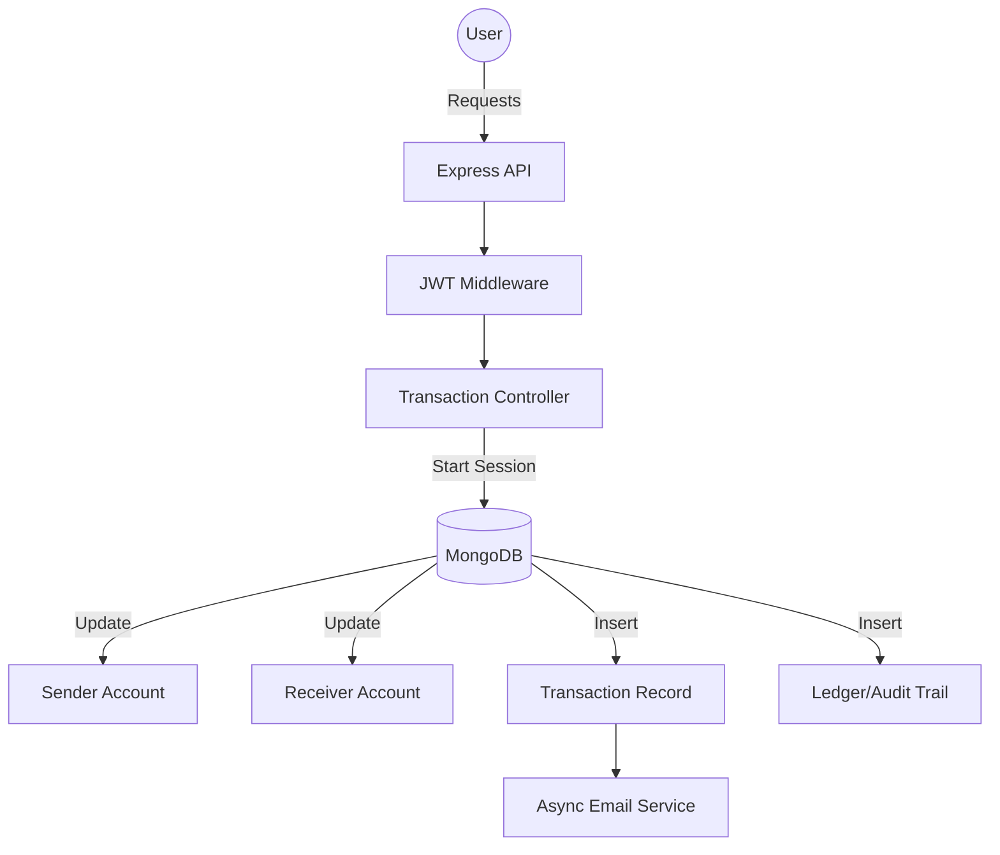

# 🛡️ SentinelLedger: Production-Grade Fintech Engine

**SentinelLedger** is a secure, high-performance financial ledger system built for reliability and data integrity. Unlike standard banking tutorials, this project implements **SDE-2 level architectural patterns** to handle real-world fintech challenges like race conditions, floating-point errors, and atomic double-entry bookkeeping.

---

## 🚀 Key Engineering Highlights

### 1. **Financial Integrity (The Pro Way)**
*   **Integer-Based Accounting**: Stores all currency in **Paise/Cents** (Integers) to eliminate floating-point rounding errors common in JavaScript.
*   **ACID Transactions**: Uses MongoDB Sessions to ensure that "Money Deducted = Money Received." If any step fails, the entire transaction rolls back perfectly.
*   **Double-Entry Bookkeeping**: Every transaction creates balanced **Debit/Credit** entries in an immutable `Ledger` for 100% audit accuracy.

### 2. **Advanced Security & Robustness**
*   **Idempotency Protection**: Prevents accidental double-charges if a user clicks "Pay" twice due to slow internet.
*   **Deadlock Prevention**: Implements **Sorted ID Locking** to prevent circular wait states during concurrent mutual transfers.
*   **Closure Verification**: Soft-closes accounts only if the balance is exactly zero and no transactions are `PENDING`.

### 3. **Smart Notification System**
*   **Asynchronous Emails**: Professional HTML transaction receipts sent via a non-blocking service, ensuring the core API remains lightning-fast.

---

## 🛠️ Tech Stack
*   **Runtime**: Node.js
*   **Framework**: Express.js
*   **Database**: MongoDB (with Mongoose Transactions)
*   **Messaging**: NodeMailer (for HTML notifications)
*   **Security**: JWT Authentication, Custom Error Middlewares

---

## 📂 System Architecture



---

## 📍 Core API Endpoints

### Authentication
| Method | Endpoint | Description |
| :--- | :--- | :--- |
| `POST` | `/api/auth/register` | Create a new user profile |
| `POST` | `/api/auth/login` | Secure login & JWT generation |
| `POST` | `/api/auth/logout` | Securely terminate the session |

### Account Management
| Method | Endpoint | Description |
| :--- | :--- | :--- |
| `POST` | `/api/account/` | Open a new bank account |
| `GET` | `/api/account/all` | List all active accounts |
| `GET` | `/api/account/balance/:id` | Real-time balance check |
| `PATCH` | `/api/account/close/:id` | Safely close an account |
| `DELETE` | `/api/account/delete/:id` | Permanent record removal |

### Transactions
| Method | Endpoint | Description |
| :--- | :--- | :--- |
| `POST` | `/api/transaction/` | Peer-to-Peer money transfer |
| `GET` | `/api/account/statement/:id` | Fetch immutable audit trail |

---

## 📜 How to Run Locally

1. **Clone the repository**
   ```bash
   git clone <your-repo-link>
   ```

2. **Install Dependencies**
   ```bash
   npm install
   ```

3. **Set up Environment Variables (.env)**
   ```env
   PORT=5000
   MONGODB_URI=your_mongodb_connection_string
   JWT_SECRET=your_secret_key
   EMAIL_USER=your_email
   EMAIL_PASS=your_app_password
   ```

4. **Start the Engine**
   ```bash
   npm run dev
   ```

---

## 🛤️ Future Roadmap
- [ ] **Multi-Factor Authentication (MFA)**: OTP verification for high-value transfers.
- [ ] **Daily Limits**: Fraud prevention by capping daily spending.
- [ ] **Admin Dashboard**: Real-time monitoring of system liquidity.
- [ ] **Redis Caching**: Faster balance lookups for high-frequency users.

---

> **Note**: This project follows strict financial industry standards (ISO 20022 principles). Built with ❤️ for the Fintech community.
