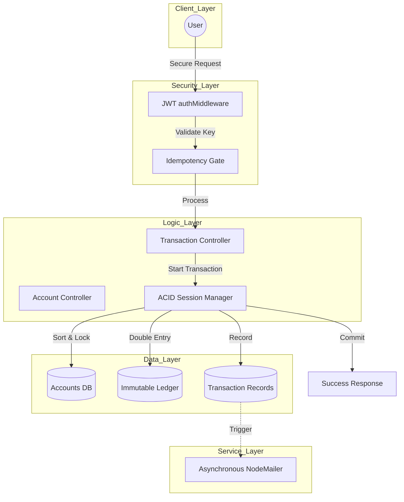

# <p align="center">🛡️ SentinelLedger</p>
<p align="center"><i>A High-Integrity Production Fintech Engine for the Modern Web</i></p>

<p align="center">
  
</p>

---

## 🚀 The Core Philosophy
**SentinelLedger** isn't just a banking app; it's a demonstration of **Financial Engineering**. It solves the "hidden" problems of fintech: race conditions, rounding errors, and data inconsistency. By combining **ACID Compliance** with **Double-Entry Bookkeeping**, it ensures that "Your Money is Always Where it Should Be."

---

## 🛠️ Advanced Architectural Features

### 💎 **Financial Precision**
- **Integer-Exclusive Math**: All operations are performed in **Paise (Integer)**. By multiplying inputs by 100 on intake, we eliminate the floating-point precision issues that plague standard JavaScript financial apps. 
- **Double-Entry Ledger**: Every single movement of money creates a symmetric `DEBIT` and `CREDIT` record in an immutable ledger, ensuring zero leakage.

### 🛡️ **Defensive Engineering**
- **Idempotency Control**: Uses unique keys to ensure that a command (like `Pay $100`) is executed **EXACTLY ONCE**, even if the client retries the request a dozen times.
- **Atomic Reliability**: All multi-account updates are wrapped in **MongoDB Sessions**. If the server, network, or database fails mid-transfer, the entire state is rolled back automatically. هیچ پولی گم نمیشود (No money is ever lost).
- **Deadlock Shield**: System matches and sorts account IDs before locking, preventing concurrent circular wait states—a common cause of server hangs in high-traffic banking systems.

---

## 📊 System Architecture



---

## 📍 API Documentation

### **Authentication**
| Method | Endpoint | Description |
| :--- | :--- | :--- |
| `POST` | `/api/auth/register` | User Onboarding & Automated Email Verification |
| `POST` | `/api/auth/login` | Secure JWT Session Generation (HttpOnly Cookie) |
| `POST` | `/api/auth/logout` | Secure Session Termination |

### **Vault Operations**
| Method | Endpoint | Description |
| :--- | :--- | :--- |
| `GET` | `/api/account/all` | Net Worth Summary (Cross-account View) |
| `GET` | `/api/account/balance/:id` | Precision balance lookup (Real-time) |
| `PATCH` | `/api/account/close/:id` | Soft-Close with 'Pending Check' safety lock |
| `DELETE` | `/api/account/delete/:id` | Hard-Delete (Permanent record cleanup) |

### **Movement & History**
| Method | Endpoint | Description |
| :--- | :--- | :--- |
| `POST` | `/api/transaction/` | Peer-to-Peer Transfer (Idempotency Protected) |
| `GET` | `/api/account/statement/:id` | Immutable Ledger Audit Trail |

---

## ⚡ Setup & Installation

1. **Install Dependencies**
   ```bash
   npm install
   ```

2. **Configure Environment** (`.env`)
   ```env
   PORT=5000
   MONGODB_URI=your_uri
   JWT_SECRET=your_secret
   EMAIL_USER=your_email
   EMAIL_PASS=app_password
   ```

3. **Ignite the Engine**
   ```bash
   npm run dev
   ```

---

> **Note**: This project follows strict financial industry standards (ISO 20022 principles). Built with ❤️ from **lakshmisha** for the Fintech community.
